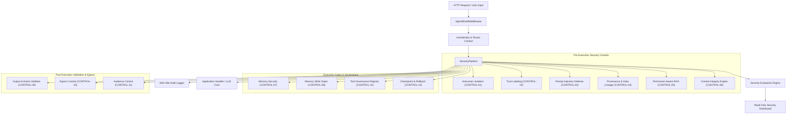

# 🛡️ AgentShield — AI Agent Security & Context Integrity Framework

[](https://python.org)
[](LICENSE)
[]()
[]()

**AgentShield** is an enterprise-grade security, safety, and governance framework designed specifically for autonomous AI agents and LLM applications. It provides defense-in-depth against prompt injection, jailbreaking, data leakage, toxic content, RAG retrieval poisoning, memory tampering, tool drift, unauthorized egress, and context integrity violations.

---

## 🚨 The AI Agent Security Problem

Autonomous AI agents operating with tools, memory stores, RAG knowledge bases, and multi-tenant context introduce severe security vectors:

- **Prompt Injection & Overrides**: Untrusted inputs overriding agent system instructions.
- **RAG Document Poisoning**: Malicious retrieved documents claiming system-level instruction authority.
- **Memory Contamination**: Unauthorized or cross-tenant write operations poisoning agent long-term memory.
- **Tool Capability Drift**: Silent modifications to tool schemas, parameters, or capabilities.
- **Sensitive Data & Credential Exfiltration**: Accidental disclosure of AWS keys, GitHub tokens, JWTs, or PII.
- **Unsafe Data Egress**: Un-sanitized information leaving security boundaries to unauthorized destinations.
- **Context Integrity Breakdown**: Silent elevation of untrusted data into trusted instruction priority.

AgentShield solves these challenges by establishing a deterministic pre-execution and post-execution security pipeline with 13 core security controls, a tamper-evident audit log, a read-only observability dashboard, and FastAPI middleware.

---

## 🏗️ Framework Architecture



---

## 🔒 Core 13 Security Controls

AgentShield implements 13 deterministic security controls:

1. **`CONTROL-01` Instruction Isolation**: Separates system instructions, user inputs, and untrusted retrieved content into isolated priority boundaries.
2. **`CONTROL-02` Trust Labeling**: Assigns immutable `TrustLabel` metadata (`TRUSTED`, `INTERNAL`, `USER_CONTROLLED`, `UNTRUSTED`, `UNKNOWN`) to all context elements.
3. **`CONTROL-03` Prompt Injection Defense**: Heuristic and pattern-based scanning for direct prompt injections, jailbreaks, roleplay overrides, and system prompt extractors.
4. **`CONTROL-04` Provenance & Data Lineage**: Tracks end-to-end cryptographic lineage (`User -> Agent -> Tool -> Sub-agent -> Output`) with SHA-256 content hashes.
5. **`CONTROL-05` Permission-Aware Retrieval**: Enforces Access Control List (ACL) filtering and poison document detection on vector RAG retrievals.
6. **`CONTROL-06` Context Integrity**: Enforces 8 security invariants preventing untrusted data from escalating into trusted instruction authority.
7. **`CONTROL-07` Memory Security**: Validates memory read operations against tenant isolation and identity scopes before context injection.
8. **`CONTROL-08` Memory Write Gates**: Enforces explicit authorization, injection scanning, and secret detection before persisting new agent memories.
9. **`CONTROL-09` Output & Action Validation**: Validates agent-generated outputs and proposed actions before external release or tool execution.
10. **`CONTROL-10` Egress Control**: Filters information leaving the security boundary against domain whitelists and DLP policies.
11. **`CONTROL-11` Token / Data Audience Control**: Validates data disclosure against token claims, recipient scopes, and audience contracts.
12. **`CONTROL-12` Tool Governance**: Detects definition drift, capability escalation, and parameter schema changes in agent tools.
13. **`CONTROL-13` Checkpoint & Rollback**: Enables creation of known-good security state snapshots and governed recovery upon security alerts.

---

## 🔌 API & FastAPI Integration

AgentShield provides a framework-independent adapter (`AgentShieldAdapter`) and ASGI middleware (`AgentShieldMiddleware`) for clean embedding into FastAPI and Python applications.

### FastAPI Middleware Example

```python
from fastapi import FastAPI, Depends
from agentshield import AgentShield, ShieldConfig
from agentshield.integration import (
    AgentShieldMiddleware,
    ShieldIdentity,
    get_security_context,
    guard_fastapi_endpoint
)

app = FastAPI(title="Secure AI Agent")
shield = AgentShield(config=ShieldConfig(strict_policy_mode=True))

# Attach AgentShield middleware for header identity extraction & security inspection
app.add_middleware(
    AgentShieldMiddleware,
    adapter=shield.adapter,
    enforce_identity=True,
    tenant_header="x-tenant-id",
    user_header="x-user-id"
)

@app.post("/chat")
@guard_fastapi_endpoint(adapter=shield.adapter)
def chat_endpoint(
    request_data: dict,
    identity: ShieldIdentity = Depends(get_security_context)
):
    return {"reply": f"Hello {identity.user_id} from tenant {identity.tenant_id}!"}
```

---

## 🖥️ Read-Only Security Dashboard

AgentShield includes a local security observability dashboard for inspecting security evaluation posture, control matrices, findings, benchmark performance metrics, tool governance state, checkpoints, and audit activity.

### Launching the Dashboard

```bash
uvicorn agentshield.dashboard.app:app --host 127.0.0.1 --port 8000
```

Access the dashboard UI at `http://127.0.0.1:8000/`.

> [!IMPORTANT]
> **Observability Only**: The dashboard is strictly a read-only observability layer. It does **NOT** independently make security decisions (`ALLOW`, `DENY`, `REVIEW`), modify application state, execute agent tools, or provide a universal security guarantee.

---

## 📊 Security Benchmark & Evaluation Corpus

AgentShield includes a structured, versioned evaluation corpus (`PRIMARY_BENCHMARK_CORPUS`, version `1.0.0`) and automated runner (`SecurityBenchmarkRunner`) used to systematically test all 13 security controls.

- **Corpus Version**: `1.0.0`
- **Total Test Cases**: `68`
- **Passed Cases**: `68`
- **Benchmark Pass Rate**: `100.0%`
- **Candidate False Positives / Negatives**: `0 / 0`

---

## ⚡ Performance Benchmarks

Measured on local representative benchmark fixtures:

| Component / Endpoint | Metric / Latency |
| :--- | :--- |
| **`GET /api/dashboard/audit` (Uncached)** | `207.76 ms` *(96.2% latency reduction / 26.5x speedup via state invalidation)* |
| **`GET /api/dashboard/audit` (Cached)** | `175.90 ms` |
| **`GET /api/dashboard/overview`** | `481.28 ms` |
| **`GET /api/dashboard/controls`** | `18.48 ms` |
| **`GET /api/dashboard/benchmark`** | `4.48 ms` |
| **Context Integrity Engine** | `< 0.50 ms per item` |
| **Security Evaluation Pass** | `< 15.00 ms` |

---

## 🧪 Test Execution & Quality

Run the complete test suite:

```bash
python -m pytest
```

### Test Suite Summary:
- **Total Tests Passed**: `470 passed`
- **Failures**: `0 failed`
- **Skipped**: `0`

---

## 🚀 Quick Start & Demonstration

To run the interactive end-to-end security demonstration:

```bash
python examples/run_agentshield_demo.py
```

---

## ⚠️ Security Claims & Known Limitations

1. **Defensive Control Framework**: AgentShield provides robust, deterministic guardrails around context boundaries, memory writes, tool governance, and outputs. It does **NOT** guarantee 100% protection against all conceivable prompt injection or jailbreak techniques.
2. **Probabilistic LLM Behavior**: Downstream LLM outputs are inherently probabilistic. AgentShield inspects and redacts inputs and outputs, but cannot alter the internal weights or reasoning of external model providers.
3. **Local Development Default**: Unauthenticated by default when running dashboard services locally; production deployments must place AgentShield behind an authenticated API gateway or reverse proxy.

---

## 📄 License

MIT License. See `LICENSE` for details.
