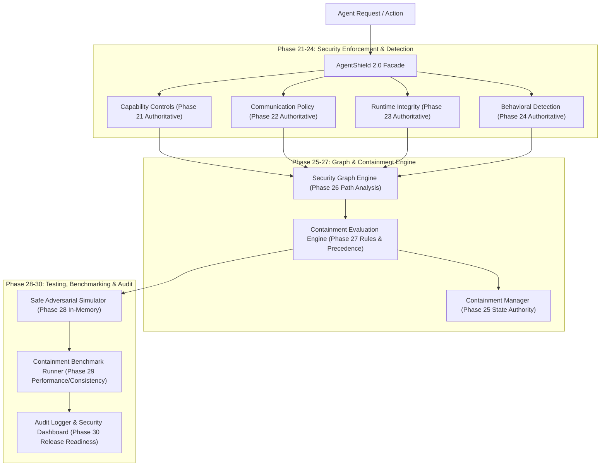

# 🛡️ AgentShield 2.0 — AI Agent Security, Containment & Context Integrity Framework

[](https://python.org)
[](LICENSE)
[]()
[]()
[]()

**AgentShield 2.0** is an enterprise-grade, defense-in-depth security, multi-signal containment, and governance framework designed specifically for autonomous AI agents, multi-agent systems, and LLM applications. 

It provides comprehensive security controls spanning prompt injection defense, capability authorization, communication egress policies, runtime integrity attestation, real-time behavioral threat detection, security graph analysis, dynamic containment evaluation, safe adversarial simulation, and deterministic auditing.

---

## 🚨 The AI Agent Security Challenge

Autonomous AI agents operating with tool execution capabilities, vector memory, multi-tenant contexts, and external communication links introduce severe security risks:

- **Prompt Injection & Overrides**: Direct and indirect injection attacks corrupting agent system instructions.
- **Unauthorized Capability Elevation**: Agents executing restricted operations beyond authorized tenant profiles.
- **Malicious Egress & Exfiltration**: Data leakage and un-sanitized external network communications.
- **Runtime Environment Tampering**: Un-attested memory drift or compromised runtime dependencies.
- **Anomalous Behavioral Patterns**: Rapid credential access, unauthorized resource traversal, and file encryption signals.
- **Cascading Multi-Agent Exploitation**: Lateral movement along security graph nodes across agent boundaries.

AgentShield 2.0 solves these challenges by establishing an end-to-end security and containment pipeline with 13 pre/post-execution security controls, 9 security engines, multi-signal containment evaluation, safe adversarial simulation, and SHA-256 tamper-evident auditing.

---

## 🏗️ System Architecture & Defense Pipeline



---

## 🔑 Key Security Engines & Authorities

| Component / Phase | Authority Level | Description |
| :--- | :--- | :--- |
| **Capability Controls (Phase 21)** | **Authoritative** | Enforces least-privilege capability profile grants and prevents unauthorized function execution. |
| **Communication Policy (Phase 22)** | **Authoritative** | Restricts external egress, protocol usage, and cross-tenant communication channels. |
| **Runtime Integrity (Phase 23)** | **Authoritative** | Attests environment state, memory signature validity, and binary execution integrity. |
| **Behavioral Detection (Phase 24)** | **Authoritative** | Detects anomalous activity patterns (e.g. rapid exfiltration, resource scanning, credential access). |
| **Containment Manager (Phase 25)** | **Authoritative** | Maintains state transitions (`NORMAL`, `RESTRICTED`, `CONTAINED`, `RECOVERY`) and emergency isolations. |
| **Security Graph Engine (Phase 26)** | **Authoritative** | Models lateral attack paths, dependencies, and node relationships without side effects. |
| **Containment Evaluator (Phase 27)** | **Recommendation Engine** | Combines cross-phase evidence deterministically to output recommendations (`ESCALATE`, `MAINTAIN`, `RELEASE_REVIEW`, `NO_ACTION`). |
| **Adversarial Simulator (Phase 28)** | **Safe Synthetic Testing** | Executes 7 deterministic, in-memory synthetic attack scenarios without external side effects. |
| **Containment Benchmark (Phase 29)** | **Performance & Consistency** | Measures pipeline latency, throughput, and invariant compliance over repeated evaluations. |

---

## 🔌 Quick Start & Code Example

```python
from agentshield import AgentShield, AgentShieldConfig
from agentshield.evaluation.containment_models import EvidenceRecord, EvaluationSeverity

# 1. Initialize main AgentShield 2.0 facade
shield = AgentShield(config=AgentShieldConfig(strict_mode=True))

# 2. Register least-privilege capability profile for an agent
shield.capability_engine.register_profile(
    tenant_id="tenant_alpha",
    agent_id="agent_007",
    allowed_capabilities=["READ_DOCUMENTS", "SUMMARIZE_TEXT"]
)

# 3. Check pre-execution capability authorization
auth_result = shield.capability_engine.authorize(
    tenant_id="tenant_alpha",
    agent_id="agent_007",
    capability="DATA_EXPORT"
)
print(f"Capability Grant: {auth_result.allowed}")  # False (Denied)

# 4. Evaluate multi-signal containment posture
ev_runtime = EvidenceRecord(
    source_phase="Phase-23",
    evidence_type="RUNTIME_INTEGRITY",
    severity=EvaluationSeverity.CRITICAL,
    tenant_id="tenant_alpha",
    agent_id="agent_007",
    references={"integrity_state": "INVALID"}
)

assessment = shield.evaluate_containment(
    tenant_id="tenant_alpha",
    agent_id="agent_007",
    evidence_list=[ev_runtime]
)

print(f"Containment Outcome: {assessment.outcome}")               # ESCALATE
print(f"Recommended Isolation: {assessment.recommended_isolation_level}")  # FULL
```

---

## ⚡ Containment Benchmark Metrics (Phase 29 & 30 Baseline)

Measured across 700 automated evaluations (7 synthetic scenarios × 100 measured iterations):

- **Total Benchmark Evaluations**: `700 / 700`
- **Pass Rate**: `100.0%`
- **Average Evaluation Latency**: `~1.56 ms`
- **Median Latency**: `~1.31 ms`
- **P95 Latency**: `~3.46 ms`
- **P99 Latency**: `~4.22 ms`
- **Max Latency**: `~4.93 ms`
- **Throughput**: `~600.13 evaluations/sec`

---

## 🧪 Test Suite & Invariant Verification

Run the full AgentShield 2.0 regression test suite:

```bash
python -m pytest
```

### Verified Test Results
- **Total Tests Passed**: `664 passed`
- **Failures / Errors**: `0`
- **Skipped**: `0`
- **Pass Rate**: `100.0%`

### Security Invariants Formally Verified
1. **Tenant Isolation**: Evidence and capability states never cross tenant boundaries.
2. **Agent Isolation**: Evidence and capability states never cross agent boundaries within the same tenant.
3. **No Capability Elevation**: Unauthorized capability requests are strictly rejected.
4. **No Policy Override**: Pre-execution communication policies remain authoritative.
5. **No Automatic Release**: Containment release recommendations (`RELEASE_REVIEW`) require explicit human/controller approval.
6. **Deterministic Evaluation**: Identical evidence inputs produce bit-identical evaluation outputs.
7. **Evidence Traceability**: Every assessment links directly to supporting evidence IDs.
8. **Simulation & Benchmark Safety**: Zero subprocesses, zero network calls, zero file system mutations.

---

## 🚀 Running Demonstrations & Benchmarks

Run the safe, end-to-end interactive demonstration:

```bash
python examples/agentshield_2_0_demo.py
```

Run the 700-evaluation containment benchmark:

```bash
python examples/benchmark_containment.py
```

---

## 📄 Documentation & Governance

- **System Architecture Guide**: [`docs/agentshield_2.0.md`](file:///c:/Users/hp/Desktop/AgentShield/docs/agentshield_2.0.md)
- **Release Readiness Report**: [`docs/release_readiness.md`](file:///c:/Users/hp/Desktop/AgentShield/docs/release_readiness.md)

---

## 🛡️ License

MIT License. See `LICENSE` for details.
