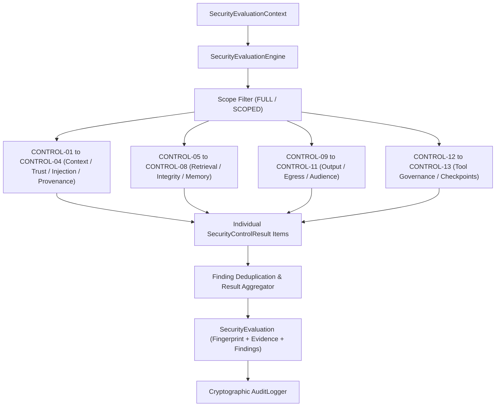

# Phase 16 — Security Evaluation Engine

## 1. Purpose
AgentShield's **Security Evaluation Engine** provides a unified, deterministic framework for orchestrating and assessing an AI agent's security posture against all 13 controls implemented across AgentShield.

> [!IMPORTANT]
> **NO FALSE CERTIFICATION**
> The evaluation engine evaluates implemented AgentShield controls and produces an evidence-based assessment. It does **NOT** prove or claim that an AI agent is universally secure, vulnerability-free, or mathematically unhackable.

## 2. Architecture
The Evaluation Engine acts as an **orchestrator** over AgentShield's security primitives:

## 3. Control Catalog
AgentShield's `ControlCatalog` maintains a stable registry of 13 implemented controls:
- **`CONTROL-01`**: Instruction Isolation (`CONTEXT`)
- **`CONTROL-02`**: Trust Labeling (`TRUST`)
- **`CONTROL-03`**: Prompt Injection Defense (`INJECTION`)
- **`CONTROL-04`**: Provenance & Data Lineage (`PROVENANCE`)
- **`CONTROL-05`**: Permission-Aware Retrieval (`RETRIEVED`)
- **`CONTROL-06`**: Context Integrity (`INTEGRITY`)
- **`CONTROL-07`**: Memory Security (`MEMORY`)
- **`CONTROL-08`**: Memory Write Gates (`MEMORY_WRITE`)
- **`CONTROL-09`**: Output & Action Validation (`OUTPUT`)
- **`CONTROL-10`**: Egress Control (`EGRESS`)
- **`CONTROL-11`**: Token / Data Audience Control (`AUDIENCE`)
- **`CONTROL-12`**: Tool Change Detection & Review (`GOVERNANCE`)
- **`CONTROL-13`**: Security Checkpoint & Rollback (`CHECKPOINT`)

## 4. Evaluation Context
`SecurityEvaluationContext` encapsulates input data for assessment:
- `identity`: Principal requesting operation (`UserIdentity`).
- `tenant_id`: Scope tenant identifier.
- `context_items`: Context payload items (`ContextItem`).
- `retrieval_request` & `retrieval_records`: RAG retrieval context.
- `memory_records` & `memory_write_request`: Read/write memory payloads.
- `agent_output` & `agent_action`: Generated output / action proposals.
- `egress_request`: External export requests.
- `audience_claim`: Target token / data audience claim.
- `tool_definitions`: Declared tool interfaces.
- `checkpoint_id`: Security checkpoint ID.
- `provenance_tracker`: Lineage tracker.
- `scope`: Evaluation scope enum.

## 5. Evaluation Scopes
Evaluations can be run across distinct operational boundaries (`EvaluationScope`):
- `FULL`: Evaluates all 13 applicable controls.
- `CONTEXT`: `CONTROL-01`, `CONTROL-02`, `CONTROL-03`, `CONTROL-06`.
- `MEMORY`: `CONTROL-07`, `CONTROL-08`.
- `TOOLS`: `CONTROL-12`.
- `OUTPUT`: `CONTROL-09`.
- `EGRESS`: `CONTROL-10`, `CONTROL-11`.
- `CHECKPOINT`: `CONTROL-13`.
- `RETRIEVED`: `CONTROL-04`, `CONTROL-05`.

Controls omitted under a specific scope are marked `NOT_EVALUATED` and do not skew overall pass rates.

## 6. Control Evaluators
Each control is evaluated by a dedicated class derived from `BaseSecurityEvaluator`:
- `InstructionIsolationEvaluator`, `TrustLabelEvaluator`, `PromptInjectionEvaluator`, `ProvenanceEvaluator`, `RetrievalAuthorizationEvaluator`, `ContextIntegrityEvaluator`, `MemorySecurityEvaluator`, `MemoryWriteEvaluator`, `OutputValidationEvaluator`, `EgressEvaluator`, `AudienceEvaluator`, `ToolGovernanceEvaluator`, `CheckpointEvaluator`.

Evaluators invoke existing AgentShield components without duplicating core validation logic.

## 7. Evidence Model
`SecurityControlResult.evidence` captures structured, non-sensitive audit metrics:
- Violation counts and rule IDs.
- Fingerprint hashes and decision flags.
- Source category distributions.
- **Redaction**: Raw credentials, secrets, passwords, API keys, and private memory contents are strictly excluded.

## 8. Finding Model
`SecurityFinding` represents an identified defensive security issue:
- `finding_id`: Unique finding ID (`fnd_<hex>`).
- `control_id`: Associated control ID.
- `severity`: Severity classification (`LOW`, `MEDIUM`, `HIGH`, `CRITICAL`).
- `title` & `description`: Defensive explanation of risk.
- `evidence`: Supporting non-sensitive evidence metadata.
- `recommendation`: Remediation guidance.
- `decision`: Security decision (`DENY`, `REVIEW`, `ISOLATE`).

Findings are automatically deduplicated by `(control_id, description, severity)`.

## 9. Aggregation Policy
The engine deterministically aggregates control results into an overall decision:
- Any `CRITICAL` or `HIGH` `FAIL` $\rightarrow$ `SecurityDecision.DENY`, Status: `FAIL`.
- Any unresolved `HIGH` or `MEDIUM` `REVIEW` $\rightarrow$ `SecurityDecision.REVIEW`, Status: `REVIEW`.
- Any `ERROR` $\rightarrow$ `SecurityDecision.DENY`, Status: `ERROR`.
- All applicable controls `PASS` $\rightarrow$ `SecurityDecision.ALLOW`, Status: `PASS`.
- No applicable controls in scope $\rightarrow$ `SecurityDecision.REVIEW`, Status: `REVIEW`.

## 10. Fail-Closed Behavior
If required identity, tenant, or evidence context is missing during evaluation of an applicable control, the engine fails closed (`SecurityDecision.DENY` or `REVIEW`). Missing evidence is **never** treated as `PASS`.

## 11. Error Handling
If an evaluator throws an unhandled exception during evaluation, it is caught cleanly, recorded with `status = ERROR`, assigned `decision = SecurityDecision.DENY`, and logged. An exception **never** silently becomes `PASS`.

## 12. Audit Lifecycle
The engine logs tamper-evident audit events via `AuditLogger`:
- `SECURITY_EVALUATION_STARTED`
- `SECURITY_CONTROL_EVALUATED`
- `SECURITY_FINDING_CREATED`
- `SECURITY_EVALUATION_COMPLETED` (or `SECURITY_EVALUATION_FAILED`)

## 13. Evaluation Fingerprint
`compute_evaluation_fingerprint()` produces a deterministic SHA-256 fingerprint over normalized evaluation results.

> [!IMPORTANT]
> **EVALUATION FINGERPRINT != SECURITY GUARANTEE**
> The evaluation fingerprint guarantees representation integrity. It does not provide an absolute guarantee of safety.

## 14. Security Invariants
1. Every evaluated control produces an explicit result.
2. Missing required evidence cannot become PASS.
3. Validator exceptions cannot become PASS.
4. CRITICAL failure cannot aggregate to ALLOW.
5. Unresolved HIGH review cannot aggregate to ALLOW.
6. Control results are traceable to the evaluated control.
7. Findings contain evidence.
8. Secrets are not included in evaluation evidence.
9. Private memory content is not included in audit records.
10. Evaluation results are immutable.
11. Evaluation fingerprint is deterministic.
12. Evaluation fingerprint does not imply trust.
13. NOT_EVALUATED is not equivalent to PASS.
14. Scoped evaluation does not claim coverage of omitted controls.
15. FULL evaluation evaluates all applicable implemented controls.
16. Control failures are preserved in the final evaluation.
17. Audit events are generated for evaluation lifecycle.
18. Evaluation does not execute agent tools.
19. Evaluation does not execute external network requests.
20. Historical evaluations are not silently modified.

## 20. Security Boundary & Non-Defensive Refutation
AgentShield's evaluation engine remains strictly defensive:
- No exploit generation or attack payload construction.
- No credential extraction or real-world target scanning.
- No unauthorized tool execution or external network probing.

## 21. Limitations
- Evaluates static state and policy compliance of AgentShield controls; runtime agent reasoning anomalies outside configured controls must be governed by SecureMCP runtime wrappers.
- Operates on local test contexts; distributed evaluation clustering can be added in future releases.
